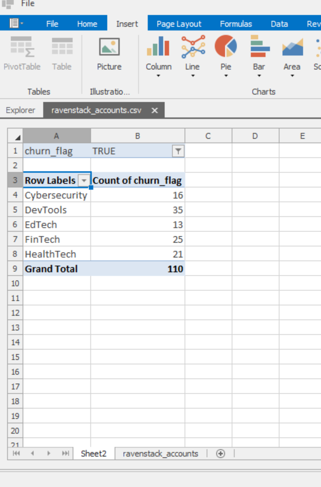
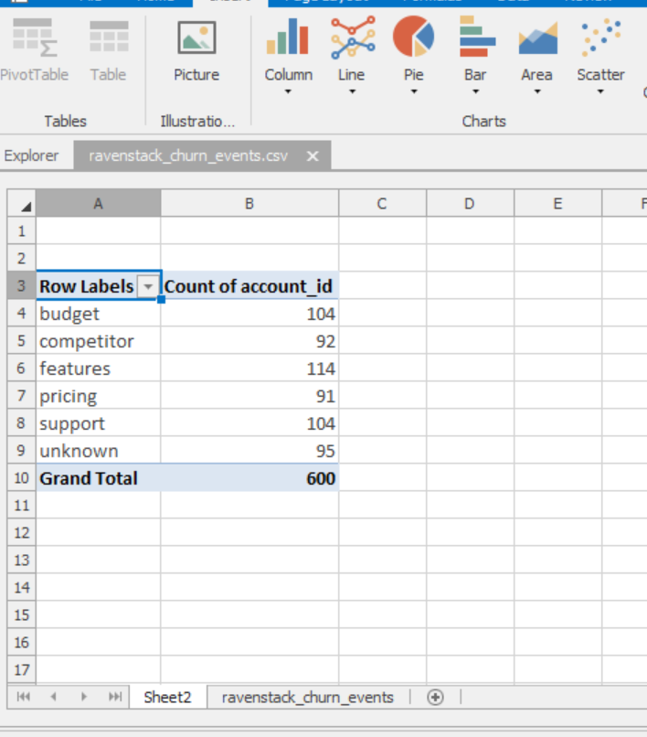

​Objective: Analyze the customer base to identify why users are churning and provide actionable recommendations.

​Key Findings:

​The DevTools industry accounts for the highest volume of churned accounts.
​The primary reason for customer departure is "Features," indicating that the current product offerings may not be meeting user expectations.
​Financial concerns ("Budget") and dissatisfaction with "Support" are also significant contributors to user churn.

​Actionable Recommendations:

​Product Development: Conduct a targeted feedback survey for the "DevTools" segment to identify specific feature gaps and prioritize them in the product roadmap.
​Support Optimization: Review support ticket resolution times, particularly for users reporting "Support" as their reason for leaving, to improve service efficiency.
​Retention Focus: Implement a proactive outreach program for the "DevTools" industry to identify "at-risk" accounts before they churn.

